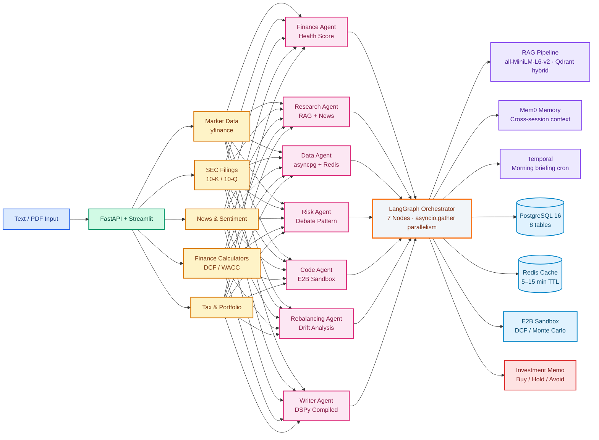

<div align="center">

# WealthOS

**Personal Financial Intelligence Platform**

[](https://python.org)
[](https://langchain.com)
[](https://fastapi.tiangolo.com)
[](https://postgresql.org)
[](https://redis.io)
[](https://streamlit.io)

*7 specialized agents × 7 MCP servers × 41 tools → one personalized investment memo in under 90 seconds.*

</div>

---

## What It Does

A user asks: **"Should I invest ₹20,000 in Reliance right now?"**

WealthOS knows their monthly surplus is ₹18,000, food spending spiked 35% last month, they have an outstanding home loan EMI, and their 80C deduction is unutilized. The output is not generic advice — it is advice for **this person, at this moment in their financial life.**

---

## Architecture



---

<div align="center">

## Agents

| Agent | Approach | Key Capability | Output |
|:---:|:---:|:---:|:---:|
| Finance Agent | Pure Python + asyncpg | z-score anomaly detection (σ = 2.0), 5-dim health score | Health Score 0–100, surplus, risk capacity |
| Research Agent | asyncio + RAG | Qdrant hybrid search on SEC 10-K filings, news fetch | Qualitative context, sentiment |
| Data Agent | asyncpg + MCPClient | Schema-validated numbers, Redis 15-min TTL, MCP fallback | `FinancialSnapshot` with confidence flag |
| Risk Agent | LangGraph 3-node debate | Macro analyst + Stock analyst run in parallel → Scorer | Risk score 1–10 + Buy/Hold/Avoid |
| Code Agent | E2B sandbox | Real Python execution — DCF, Monte Carlo (1 000 paths), sensitivity table | Intrinsic value, upside probability |
| Rebalancing Agent | Pure Python | 5% drift threshold, sector concentration warning | Rebalance actions with urgency |
| Writer Agent | DSPy BootstrapFewShot | Compiled few-shot prompt (28 golden examples) + hand-written fallback | 7-section investment memo |

</div>

---

<div align="center">

## MCP Servers

| Server | Tools | Data Source |
|:---:|:---:|:---:|
| `market_server` | 10 | yfinance — price, P/E, market cap, historical, sector, competitors |
| `sec_edgar_server` | 4 | SEC EDGAR — 10-K / 10-Q filing URLs + XBRL facts |
| `news_server` | 4 | NewsAPI + Firecrawl — headlines, sentiment, Reddit |
| `finance_server` | 6 | PostgreSQL — transactions, anomalies, subscriptions, EMIs, goals |
| `calculator_server` | 7 | XIRR (scipy brentq), SIP, EMI, FIRE, compound interest, goal savings |
| `tax_server` | 4 | Old vs new regime, STCG/LTCG (Budget 2024 rates), advance tax, 80C suggestions |
| `portfolio_server` | 6 | PostgreSQL + yfinance — holdings, P&L, allocation, add/remove holding |

**41 tools · stdio transport via MCPClient subprocess**

</div>

---

<div align="center">

## Under the Hood

| Category | Implementation | Detail |
|:---:|:---:|:---|
| **Orchestration** | LangGraph 7-node state machine | `asyncio.gather` for parallel data+research and parallel risk+code — ~2× speedup |
| **MCP Transport** | MCPClient stdio subprocess | Each agent spawns the MCP server as a subprocess; JSON-RPC over stdin/stdout; retry-on-crash |
| **LLM** | Groq `llama-3.3-70b-versatile` | Key rotation across up to 3 Groq keys to stay under 12k TPM free tier limit |
| **RAG** | Qdrant hybrid search + Cohere reranking | `all-MiniLM-L6-v2` 384-dim dense (local CPU, no API key) + BM25 sparse; RRF fusion; 725 points indexed (AAPL/MSFT/NVDA 10-K) |
| **Embeddings** | sentence-transformers/all-MiniLM-L6-v2 | 384-dim, runs on CPU, no API key required |
| **Prompt Optimization** | DSPy BootstrapFewShot | 28 golden examples; compiled to `eval/compiled_writer.json`; structural quality metric (7 sections + verdict) |
| **Observability** | LangSmith + W&B Weave | `@trace_node` on all 8 nodes; token/cost logged per run to `analysis_history` table and `logs/query_log.jsonl` |
| **Memory** | Mem0 | Cross-session user memory; injected at pipeline start, written at writer node end |
| **Code Execution** | E2B cloud sandbox | Isolated Docker container per run; DCF, Monte Carlo (1 000 paths), sensitivity grid |
| **Validation** | Custom Pydantic v2 validators | `guardrails/validators.py` — risk score 1–10, verdict in {Buy, Hold, Avoid}, memo section presence |
| **Auth** | bcrypt 5.x direct + PostgreSQL `users` table | passlib removed (incompatible with bcrypt 5.x); 72-byte UTF-8 cap before hash and verify |
| **Session** | streamlit-cookies-controller | 30-day browser cookies; restored on every refresh; cleared on sign-out |
| **Notifications** | Composio | Gmail + WhatsApp delivery without OAuth boilerplate |
| **Durability** | Temporal | Morning briefing cron at 08:00; crash-safe with automatic retry |

</div>

---

<div align="center">

## Tech Stack

| Layer | Technologies |
|:---:|:---|
| **Orchestration** | LangGraph (7-node StateGraph) · Temporal (durable workflows) |
| **LLM** | Groq `llama-3.3-70b-versatile` with 3-key rotation |
| **Embeddings** | `sentence-transformers/all-MiniLM-L6-v2` (384-dim, local CPU) |
| **RAG** | Qdrant local (hybrid dense + BM25 sparse · RRF fusion) · Cohere reranking |
| **Memory** | Mem0 (cross-session vector memory) |
| **Prompt Optimization** | DSPy BootstrapFewShot (28 golden examples) |
| **Validation** | Custom Pydantic v2 validators |
| **Code Execution** | E2B Sandbox |
| **Database** | PostgreSQL 16 (8 tables: transactions, subscriptions, goals, emis, financial\_facts, portfolio\_holdings, tracked\_symbols, analysis\_history, users) |
| **Vector Store** | Qdrant (local, localhost:6333) |
| **Cache** | Redis (5-min market data TTL · 15-min snapshot TTL) |
| **MCP Transport** | MCPClient stdio subprocess (services/mcp\_client.py) |
| **Notifications** | Composio (Gmail + WhatsApp) |
| **Observability** | LangSmith (pipeline traces) · W&B Weave (eval quality) |
| **Backend** | FastAPI |
| **Frontend** | Streamlit (dark theme · permanent sidebar · cookie sessions) |

</div>

---

<div align="center">

## Roadmap

| Feature | Status |
|:---:|:---:|
| Multi-user auth — signup / login / bcrypt / cookie sessions | ✅ Done |
| Full 7-agent pipeline end-to-end | ✅ Done |
| MCP stdio transport via MCPClient | ✅ Done |
| LangSmith tracing on all 8 nodes | ✅ Done |
| RAG — 725+ Qdrant points (AAPL / MSFT / NVDA / GOOGL / TSLA / AMZN 10-K) | ✅ Done |
| DSPy BootstrapFewShot compiled writer (28 golden examples) | ✅ Done |
| W&B Weave LLM-as-judge eval (4-dimension scoring) | ✅ Done |
| Analysis history — full memo stored, sidebar + Reports page | ✅ Done |
| Personal document RAG (salary slips, bank statements via OCR) | ✅ Done |
| A2A agent cards at `/agents` endpoint | ✅ Done |
| Dockerfiles (api / frontend) | ✅ Done |
| `user_analyses` Qdrant collection — per-user verdict vectors | ✅ Done |
| Indian stock BSE PDF indexer (30 companies) | 🔄 Planned |
| Investment horizon routing (short / mid / long-term) | 🔄 Planned |
| API key auth + rate limiting on `/analyze` | 🔄 Planned |
| DeepEval CI gate | 🔄 Planned |
| Full news article body fetch (newspaper3k) | 🔄 Planned |
| Earnings call transcript indexing | 🔄 Planned |

</div>

---

<div align="center">

## Quick Start

```bash
git clone https://github.com/AmanDataGuy/WealthOS
cd WealthOS
python -m venv venv && venv\Scripts\activate   # Windows
pip install -r requirements.txt
cp .env.example .env                           # fill in GROQ_API_KEY, WEALTHOS_DB_URL, etc.
```

**Start infrastructure (Docker Desktop must be running):**
```bash
docker start wealthos-postgres wealthos-redis wealthos-qdrant
```

**Start API and UI (Windows — sets UTF-8 encoding required for emoji prints):**
```powershell
$env:PYTHONIOENCODING='utf-8'
python -m uvicorn api.main:app --host 0.0.0.0 --port 8000
# in a second terminal:
streamlit run wealthos_app.py --server.port 8501
```

Open **http://localhost:8501** — sign up or use `admin / wealthos123`.

**Index SEC filings for RAG (first time only):**
```bash
python -m rag.pipeline batch AAPL MSFT NVDA
```

**Required environment variables:**

| Variable | Purpose |
|---|---|
| `GROQ_API_KEY` | Primary LLM (required) |
| `WEALTHOS_DB_URL` | PostgreSQL connection string (required) |
| `REDIS_URL` | Redis (default: `redis://localhost:6379`) |
| `QDRANT_URL` | Qdrant (default: `http://localhost:6333`) |
| `E2B_API_KEY` | Code sandbox — DCF / Monte Carlo |
| `MEM0_API_KEY` | Cross-session memory |
| `LANGCHAIN_API_KEY` | LangSmith pipeline tracing |
| `WANDB_API_KEY` | W&B Weave eval tracking |
| `COHERE_API_KEY` | RAG reranking |

See `.env.example` for the full list.

---

## Demo

**Suggested tickers for a live walkthrough:**

| Market | Tickers | Coverage |
|--------|---------|----------|
| US | `NVDA` `MSFT` `AAPL` `AMZN` `GOOGL` `TSLA` | Full SEC 10-K indexed |
| India | `SBIN` `RELIANCE` `TCS` `INFY` `WIPRO` `HCLTECH` `ICICIBANK` `HDFCBANK` | yfinance annual report indexed |

**3-minute script:**

1. Enter `NVDA` with a sample financial profile → watch the 7-node graph execute → point out DCF intrinsic value, Monte Carlo P10/P50/P90, and personalised risk score
2. Switch to `SBIN` → same pipeline, currency auto-switches to `₹`, RAG pulls from Indian market data
3. Open `/docs` → show the REST API schema and JWT auth

Any ticker works — the system fetches live data via yfinance even without a pre-indexed filing (RAG context is limited but DCF, Monte Carlo, and risk scoring still run fully).

</div>
