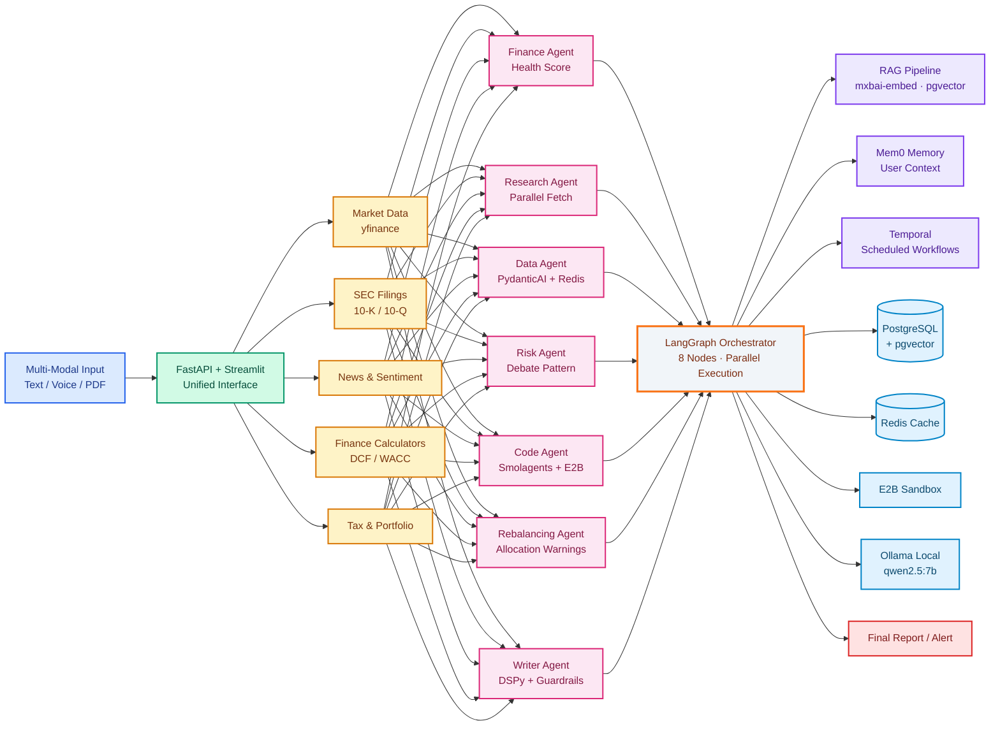

<div align="center">

# WealthOS

**Personal Financial Intelligence Platform**

[](https://python.org)
[](https://langchain.com)
[](https://fastapi.tiangolo.com)
[](https://postgresql.org)
[](https://redis.io)
[](https://streamlit.io)

*7 specialized agents × 7 MCP servers × 43 tools → one personalized investment memo in under 90 seconds.*

</div>

---

## What It Does

A user asks: **"Should I invest ₹20,000 in Reliance right now?"**

WealthOS knows their monthly surplus is ₹18,000, food spending spiked 35% last month, they have an outstanding home loan EMI, and their 80C deduction is unutilized. The output is not generic advice — it is advice for **this person, at this moment in their financial life.**

---

---

## Architecture


---

---

<div align="center">

## Agents

| Agent | Framework | Key Capability | Output |
|:---:|:---:|:---:|:---:|
| Finance Agent | Pure Python | z-score anomaly detection (σ = 1.5) | Health Score 0–100, surplus, subscriptions |
| Research Agent | asyncio | parallel fetch — market + news + SEC | Sentiment, macro context |
| Data Agent | PydanticAI | schema-validated numbers, Redis 15-min TTL | `FinancialSnapshot` with confidence flag |
| Risk Agent | LangGraph (3-node debate) | Macro, Stock, Scorer agents | Risk score 1–10 + recommendation |
| Code Agent | Smolagents + E2B | sandbox-executed Python | DCF intrinsic value, Monte Carlo distribution |
| Rebalancing Agent | Pure Python | >40% sector concentration warning | Rebalance recommendation |
| Writer Agent | DSPy + LangGraph | compiled few-shot prompt, Guardrails AI validated | Final investment memo |

</div>

---

---

<div align="center">

##  MCP Servers

| Server | Tools | Data Source |
|:---:|:---:|:---:|
| `market_server` | 10 | yfinance — price, P/E, market cap, historical |
| `sec_edgar_server` | 3 | SEC EDGAR — 10‑K / 10‑Q filing URLs |
| `news_server` | 3 | NewsAPI — headlines + sentiment |
| `finance_server` | 5 | PostgreSQL — transactions, anomalies, subscriptions |
| `calculator_server` | 13 | DCF, WACC, CAGR, capital gains, tax math |
| `tax_server` | 5 | 80C / HRA / slabs — old vs new regime |
| `portfolio_server` | 4 | PostgreSQL + yfinance — holdings, P&L, allocation |

**Total: 43 tools across 7 servers**

</div>

---

---

<div align="center">

## 🔬 Under the Hood

| Category | Implementation | Why It Matters |
|:---:|:---:|:---|
| **Observability** | LangSmith · AgentOps · W&B Weave | 3‑layer tracing: pipeline latency, agent decisions, eval scores |
| **Memory** | Mem0 vector memory | Cross‑session recall of past analyses and user context |
| **Durability** | Temporal workflows | Crash‑safe execution with automatic retry & checkpointing |
| **Code Sandbox** | E2B | Secure Python execution for DCF & Monte Carlo models |
| **Retrieval** | Hybrid (vector + keyword injection) | Prevents hallucinated numbers from financial tables |
| **LLM Stack** | `qwen2.5:7b` + `mxbai-embed-large` (Ollama) | 100% local · zero API cost · fits on RTX 3050 6GB |
| **Parallelism** | `asyncio.gather` in LangGraph | 2× speedup vs sequential agent execution |
| **Validation** | Guardrails AI + Pydantic v2 | Blocks impossible outputs before they reach the user |
| **Prompt Optimization** | DSPy BootstrapFewShot (15 golden examples) | Compiled prompt measurably outperforms hand‑written baseline |
| **Notifications** | Composio | Gmail + WhatsApp alerts without OAuth boilerplate |
| **Vector Store** | pgvector (PostgreSQL extension) | One database for everything—no separate Qdrant container |

</div>

---

---

<div align="center">

## 🧰 Tech Stack

| Layer | Technologies |
|:---:|:---|
| **Orchestration** | LangGraph (8‑node state machine) · Temporal (durable workflows) |
| **Agents** | PydanticAI · Smolagents · Pure Python |
| **LLM** | `qwen2.5:7b` (Ollama) · Groq (fallback) |
| **RAG** | Custom indexer · pgvector · `mxbai-embed-large` (1,024‑dim · ~1,640 chunks) |
| **Memory** | Mem0 (cross‑session vector memory) |
| **Prompt Optimization** | DSPy (BootstrapFewShot) |
| **Validation** | Guardrails AI · Pydantic v2 |
| **Code Execution** | E2B Sandbox |
| **Database** | PostgreSQL 16 (9 tables, pgvector, pgcrypto) |
| **Cache** | Redis (15‑min TTL, pub/sub) |
| **Notifications** | Composio (Gmail + WhatsApp) |
| **Observability** | LangSmith · AgentOps · W&B Weave |
| **Backend** | FastAPI |
| **Frontend** | Streamlit |

</div>

---

---

<div align="center">

## 🚧 Roadmap

| Feature | Status |
|:---:|:---:|
| Docker Compose · AWS EC2 deployment | 🔄 In Progress |
| Multi‑user authentication & isolated portfolios | 🔄 Planned |
| Real‑time price alerts via Kafka | 🔄 Planned |
| Fine‑tuned Writer Agent (LoRA on Qwen) | 🔄 Planned |

</div>

---

---

<div align="center">
  
## 🚀 Quick Start

```bash
git clone https://github.com/AmanDataGuy/WealthOS
cd WealthOS
python3 -m venv venv && source venv/bin/activate
pip install -r requirements.txt
cp .env.example .env

# Start services (WSL)
sudo service postgresql start
redis-server --daemonize yes
ollama serve &
ollama pull qwen2.5:7b
ollama pull mxbai-embed-large

# Run
uvicorn api.main:app --reload --port 8000
streamlit run wealthos_app.py --server.port 8501
