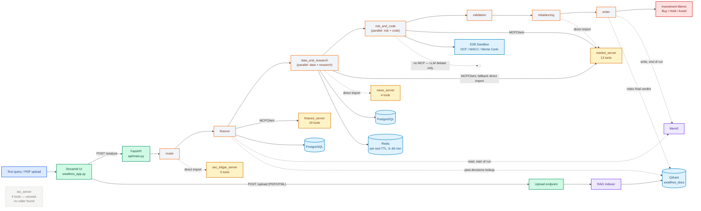

<div align="center">

# WealthOS

**Personal Financial Intelligence Platform**

[](https://python.org)
[](https://langchain.com)
[](https://fastapi.tiangolo.com)
[](https://postgresql.org)
[](https://redis.io)
[](https://streamlit.io)

*8 specialized agents × 5 MCP servers × 45 tools → one personalized investment memo, grounded in real filings and computed math.*

</div>

---

## What It Does

A user asks: **"Should I invest ₹20,000 in Reliance right now?"**

WealthOS knows their monthly surplus is ₹18,000, food spending spiked 35% last month, they have an outstanding home loan EMI, and their 80C deduction is unutilized. It remembers their last three analyses across sessions. The output is not generic advice — it is advice for **this person, at this moment in their financial life.**

---

## Architecture


```mermaid
flowchart LR
    classDef input fill:#dbeafe,stroke:#2563eb,stroke-width:2px,color:#1e3a8a
    classDef interface fill:#d1fae5,stroke:#059669,stroke-width:2px,color:#064e3b
    classDef mcp fill:#fef3c7,stroke:#d97706,stroke-width:2px,color:#78350f
    classDef mcpdead fill:#f5f5f4,stroke:#a8a29e,stroke-width:1px,color:#78716c,stroke-dasharray: 4 3
    classDef graphnode fill:#f1f5f9,stroke:#f97316,stroke-width:2px,color:#7c2d12
    classDef intel fill:#ede9fe,stroke:#7c3aed,stroke-width:2px,color:#4c1d95
    classDef data fill:#e0f2fe,stroke:#0284c7,stroke-width:2px,color:#0c4a6e
    classDef output fill:#fee2e2,stroke:#dc2626,stroke-width:2px,color:#7f1d1d
    classDef separate fill:#f5f5f4,stroke:#78716c,stroke-width:2px,color:#44403c

    Input[Text query / PDF upload]:::input --> UI[Streamlit UI<br>wealthos_app.py]:::interface
    UI -- "POST /analyze" --> API[FastAPI<br>api/main.py]:::interface
    UI -- "POST /upload (PDF/HTML)" --> Upload[Upload endpoint]:::interface
    Upload --> Indexer[RAG Indexer]:::intel --> Qdrant[(Qdrant<br>wealthos_docs)]:::data

    API --> N0[router]:::graphnode
    N0 --> N1[finance]:::graphnode
    N1 --> N2["data_and_research<br>(parallel: data + research)"]:::graphnode
    N2 --> N3["risk_and_code<br>(parallel: risk + code)"]:::graphnode
    N3 --> N4[validation]:::graphnode
    N4 --> N5[rebalancing]:::graphnode
    N5 --> N6[writer]:::graphnode
    N6 --> Output[Investment Memo<br>Buy / Hold / Avoid]:::output

    N0 -. "direct import" .-> SEC[sec_edgar_server<br>5 tools]:::mcp

    N1 -- MCPClient --> FIN[finance_server<br>19 tools]:::mcp
    N1 --> PG1[(PostgreSQL)]:::data
    N1 -. "read, start of run" .-> Mem0[Mem0]:::intel
    N1 -. "past-decisions lookup" .-> Qdrant

    N2 -- "MCPClient, fallback direct import" --> MKT[market_server<br>13 tools]:::mcp
    N2 -. "direct import" .-> NEWS[news_server<br>4 tools]:::mcp
    N2 --> PG2[(PostgreSQL)]:::data
    N2 --> Redis[(Redis<br>per-tool TTL, 5–60 min)]:::data

    N3 -- MCPClient --> MKT
    N3 --> Sandbox[E2B Sandbox<br>DCF / WACC / Monte Carlo]:::data
    N3 -. "no MCP — LLM debate only" .-> RiskNote(( )):::mcpdead

    N5 -. "direct import" .-> MKT

    N6 -. "write, end of run" .-> Mem0
    N6 -. "index final verdict" .-> Qdrant

    TAX[tax_server<br>4 tools — unused,<br>no caller found]:::mcpdead
```

> Arrows above map to actual imports as of the last fact-check (2026-08-20): `sec_edgar_server`, `news_server`, and `rebalancing`'s market calls go through **direct Python imports**, not the MCP protocol — only `finance`, `data_and_research`, and `risk_and_code` go through `MCPClient`. `tax_server` has 4 real tools but no agent currently calls it.

---

<div align="center">

## Agents

| Agent | Approach | Key Capability | Output |
|:---:|:---:|:---:|:---:|
| Router Agent | LLM classification + Qdrant count | Classifies horizon (short/mid/long), company tier; triggers on-demand SEC 10-K download + indexing as background task when tier is `not_indexed` | `investment_horizon`, `company_tier`, `fetch_plan` |
| Finance Agent | Pure Python + asyncpg | Z-score spending anomaly detection (≥2σ from per-category mean, min 3 data points; severity low/medium/high at 2–2.5/2.5–3/3+σ), 5-dim health score | Health Score 0–100, surplus, risk capacity |
| Research Agent | asyncio + RAG | Qdrant hybrid search on SEC 10-K filings, news fetch | Qualitative context, sentiment |
| Data Agent | asyncpg + MCPClient | Schema-validated numbers, Redis 15-min TTL, MCP fallback | `FinancialSnapshot` with confidence flag |
| Risk Agent | LangGraph 3-node debate | `_get_macro_context()` fetches live VIX / 10Y yield / S&P 500 / Fed Funds Rate; Stock analyst runs in parallel; Scorer injects past decisions (Qdrant) + user risk profile (Postgres); MacroAnalyst cites actual live figures | Risk score 1–10 + Buy/Hold/Avoid |
| Code Agent | E2B sandbox | Real Python execution — DCF, Monte Carlo (1 000 paths), sensitivity table | Intrinsic value, upside probability |
| Rebalancing Agent | Pure Python | Flags any sector drifting >5 percentage points from its target allocation | Rebalance actions with urgency |
| Writer Agent | DSPy BootstrapFewShot | Compiled few-shot prompt (28 golden examples); source citation trust hierarchy; injects user risk profile (buy/hold/avoid history) into Personal Finance Fit section; Final Verdict indexed to Qdrant `user_analyses` after each run | 7-section investment memo |

</div>

---

<div align="center">

## MCP Servers

| Server | Tools | Data Source |
|:---:|:---:|:---:|
| `market_server` | 13 | yfinance — price, P/E, market cap, historical, sector, competitors, options, technicals, VIX; FRED — 10Y yield, fed funds rate (yfinance fallback if no key) |
| `sec_edgar_server` | 5 | SEC EDGAR — 10-K / 10-Q filing URLs + XBRL facts |
| `news_server` | 4 | NewsAPI + Firecrawl + newspaper3k — headlines, full article body, sentiment, Reddit |
| `finance_server` | 19 | PostgreSQL + yfinance — transactions, EMIs, goals, portfolio holdings/P&L/allocation, plus pure financial math (XIRR, EMI, FIRE, SIP). Merged from 3 servers — 2 of the 3 weren't spawned via MCP by any live caller before the merge |
| `tax_server` | 4 | Old vs new regime, STCG/LTCG (Budget 2024 rates), advance tax, 80C suggestions. Not currently called by any agent — verified live 2026-08-20 |

**45 tools total** — most go through MCPClient stdio subprocess; `sec_edgar_server` (5), `news_server` (4), and `rebalancing`'s market calls bypass MCP entirely via direct Python import; `tax_server`'s 4 tools have no caller at all (see diagram footnote above)

</div>

---

<div align="center">

## Under the Hood

| Category | Implementation | Detail |
|:---:|:---:|:---|
| **Orchestration** | LangGraph 8-node state machine | `asyncio.gather` for parallel data+research and parallel risk+code — ~2× speedup |
| **Routing** | Router Agent (node 0) | LLM classifies investment horizon; Qdrant chunk-count sets company tier (`well_indexed` / `thin_indexed` / `not_indexed`); fires `_on_demand_index()` as background task for unknown tickers |
| **MCP Transport** | MCPClient stdio subprocess (`finance`, `data_and_research`/market) | JSON-RPC over stdin/stdout, retry-on-crash; `sec_edgar_server`/`news_server`/`rebalancing`'s market calls bypass this via direct Python import instead |
| **LLM** | Groq `openai/gpt-oss-120b` + OpenRouter fallback | Key rotation across up to 3 Groq keys; if all fail, falls back to OpenRouter's free `openai/gpt-oss-20b:free` |
| **RAG** | Qdrant hybrid search + Cohere reranking | `all-MiniLM-L6-v2` 384-dim dense (local CPU, no API key) + BM25 sparse; RRF fusion; SEC 10-K filings indexed for AAPL/MSFT/NVDA/GOOGL/TSLA/AMZN |
| **Embeddings** | sentence-transformers/all-MiniLM-L6-v2 | 384-dim, runs on CPU, no API key required |
| **Memory** | Three-layer | (1) Mem0 — 2-line cross-session signal injected at pipeline start; (2) Qdrant `user_analyses` — Final Verdict embedded and written after every run, semantic past-decision retrieval; (3) Postgres `user_risk_profiles` — buy/hold/avoid counts, avg risk score, preferred sectors, updated per run |
| **Macro Data** | FRED + yfinance fallback | `_get_macro_context()` returns 10Y treasury yield, VIX, S&P 500, fed funds rate, plus derived `vix_regime` and `rate_environment` labels; FRED supplies 10Y yield + fed funds rate when a key is set, VIX and S&P 500 always come from yfinance; macro cache TTL is 15 minutes |
| **Prompt Optimization** | DSPy BootstrapFewShot | 28 golden examples; compiled to `eval/compiled_writer.json`; structural quality metric (7 sections + verdict) |
| **Observability** | LangSmith (primary) + W&B Weave (init hook) | `@trace_node` on all 8 nodes; `user_id` masked to first 8 chars in trace metadata (PII); 4-dimension LLM-as-judge scoring (correctness, groundedness, relevance, structure) in `eval/evaluate.py` |
| **Rate Limiting** | Redis sliding-window log | 10 req/min per `user_id` on `/analyze`; configurable via `ANALYZE_RATE_LIMIT` env var; returns HTTP 429 + `Retry-After`; fails open if Redis is unreachable |
| **Personal Docs** | Permanent storage | Uploaded PDFs saved to `data/personal_docs/{user_id}/{filename}`; re-indexed on re-upload without duplication (delete-before-upsert in Qdrant) |
| **Code Execution** | E2B cloud sandbox | Isolated Docker container per run; DCF, Monte Carlo (1 000 paths), sensitivity grid |
| **Validation** | Custom Pydantic v2 validators | `validation/validators.py` — risk score 1–10, verdict in {Buy, Hold, Avoid}, memo section presence |
| **Auth** | bcrypt 5.x + PostgreSQL `users` table + JWT | passlib removed (incompatible with bcrypt 5.x); 72-byte UTF-8 cap before hash/verify; `/auth/login` and `/auth/signup` issue an HS256 JWT (30-day expiry) that every `{user_id}`-scoped endpoint verifies against the requested `user_id` |
| **Session** | streamlit-cookies-controller | 30-day browser cookies; restored on every refresh; cleared on sign-out |

</div>

---

<div align="center">

## Tech Stack

| Layer | Technologies |
|:---:|:---|
| **Orchestration** | LangGraph (8-node StateGraph) |
| **LLM** | Groq `openai/gpt-oss-120b` with 3-key rotation |
| **Embeddings** | `sentence-transformers/all-MiniLM-L6-v2` (384-dim, local CPU) |
| **RAG** | Qdrant local (hybrid dense + BM25 sparse · RRF fusion) · Cohere reranking |
| **Memory** | Mem0 (signal) · Qdrant `user_analyses` (semantic past verdicts) · Postgres `user_risk_profiles` (quantitative profile) |
| **Prompt Optimization** | DSPy BootstrapFewShot (28 golden examples) |
| **Validation** | Custom Pydantic v2 validators |
| **Code Execution** | E2B Sandbox |
| **Database** | PostgreSQL 16 (11 tables — 9 from `scripts/init_db.sql`: transactions, subscriptions, financial\_goals, emis, financial\_facts, portfolio\_holdings, tracked\_symbols, indexed\_tickers, user\_risk\_profiles; 2 created lazily by the API on startup: users, analysis\_history) |
| **Vector Store** | Qdrant (local, localhost:6333) — `wealthos_docs` + `user_analyses` collections |
| **Cache** | Redis (5-min market data TTL · 15-min snapshot TTL · 15-min macro TTL · 30-min sector TTL · 1-hour financials/info/recommendations TTL) |
| **MCP Transport** | MCPClient stdio subprocess (services/mcp\_client.py) — not used by all servers, see Under the Hood |
| **Macro Data** | FRED API (`fredapi`) · yfinance fallback (^TNX, ^VIX, ^GSPC) |
| **Observability** | LangSmith (pipeline traces · PII-masked user\_id) · W&B Weave (eval quality) |
| **Backend** | FastAPI (rate-limited · permanent doc storage) |
| **Frontend** | Streamlit (light theme · cookie sessions · session memory view) |

</div>

---

<div align="center">

## Quick Start

```bash
git clone https://github.com/AmanDataGuy/WealthOS
cd WealthOS
python -m venv venv && venv\Scripts\activate   # Windows
pip install -r requirements.txt
cp .env.example .env                           # fill in GROQ_API_KEY, WEALTHOS_DB_URL, etc.
```

**Start infrastructure (Docker Desktop must be running):**
```bash
docker start wealthos-postgres wealthos-redis wealthos-qdrant
```

**Initialise the database:**
```bash
psql -h localhost -U wealthos -d wealthos -f scripts/init_db.sql
```

**Start API and UI (Windows — sets UTF-8 encoding required for emoji prints):**
```powershell
$env:PYTHONIOENCODING='utf-8'
python -m uvicorn api.main:app --host 0.0.0.0 --port 8000
# in a second terminal:
streamlit run wealthos_app.py --server.port 8501
```

Open **http://localhost:8501** — sign up, or use demo accounts: `admin / wealthos123` · `demo / demo123`.

**Index SEC filings for RAG (first time only):**
```bash
python -m rag.indexer batch AAPL MSFT NVDA GOOGL TSLA AMZN
```

**Required environment variables:**

| Variable | Purpose |
|---|---|
| `GROQ_API_KEY` | Primary LLM (required) |
| `WEALTHOS_DB_URL` | PostgreSQL connection string (required) |
| `REDIS_URL` | Redis (default: `redis://localhost:6379`) |
| `QDRANT_URL` | Qdrant (default: `http://localhost:6333`) |
| `E2B_API_KEY` | Code sandbox — DCF / Monte Carlo |
| `MEM0_API_KEY` | Cross-session memory |
| `LANGCHAIN_API_KEY` | LangSmith pipeline tracing |
| `WANDB_API_KEY` | W&B Weave eval tracking |
| `COHERE_API_KEY` | RAG reranking |
| `FRED_API_KEY` | Macro data — 10Y yield, fed funds rate (optional; yfinance fallback) |
| `FIRECRAWL_API_KEY` | News/Reddit full-article scraping; earnings call transcript indexing |
| `WEALTHOS_JWT_SECRET` | Signs the JWTs that protect every `{user_id}`-scoped endpoint — recommended, fails open (no auth) if unset |

See `.env.example` for the full list. `GROQ_API_KEY` also needs to be set as a **GitHub Actions repo secret** for the DeepEval CI gate (`.github/workflows/eval.yml`) to run.

---

## Demo


*The Analyze page — set a ticker, investment amount, horizon, and optionally attach loan/EMI documents for personalised context.*


*A completed memo — verdict, risk score, and DCF intrinsic value up top, followed by the full 7-section analysis.*

**Suggested tickers for a live walkthrough:**

| Market | Tickers | RAG Coverage |
|--------|---------|----------|
| US | `NVDA` `MSFT` `AAPL` `AMZN` `GOOGL` `TSLA` | Full SEC 10-K indexed in Qdrant |
| India | `SBIN` `RELIANCE` `TCS` `INFY` `WIPRO` `HCLTECH` `ICICIBANK` `HDFCBANK` | Live via yfinance (no pre-indexed filing) |

**3-minute script:**

1. **Analyze page** — In the query box write e.g. *"I have ₹30k–50k to invest and I'm fairly conservative. Should I add NVDA to my portfolio right now?"* · set Ticker to `NVDA` · pick **Long-term** horizon · hit **Run analysis** (runtime varies — first-time tickers trigger background filing indexing) → results show Verdict pill, Risk score bar, DCF intrinsic value, and the full 7-section memo with a Download button
2. Expand **Agent log** at the bottom → walk through each node: Router → Finance → Data → Research → Risk → Code → Rebalancing → Writer
3. Switch to **History** page → open the **Memory** sub-tab → show the investor profile (total analyses, Buy/Hold/Avoid counts, avg risk score, tracked sectors) and the past-decisions table that feeds every new risk analysis
4. Open **`http://<host>:8000/docs`** → show the rate-limited `/analyze` endpoint (10 req/min per user), `/upload-personal-doc`, and A2A agent cards at `/agents`

Any ticker works — live data via yfinance even without a pre-indexed filing; unknown tickers trigger on-demand 10-K download and Qdrant indexing in the background.

</div>
