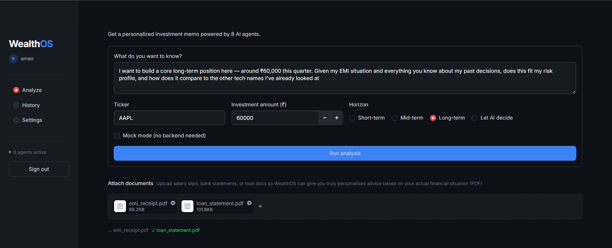
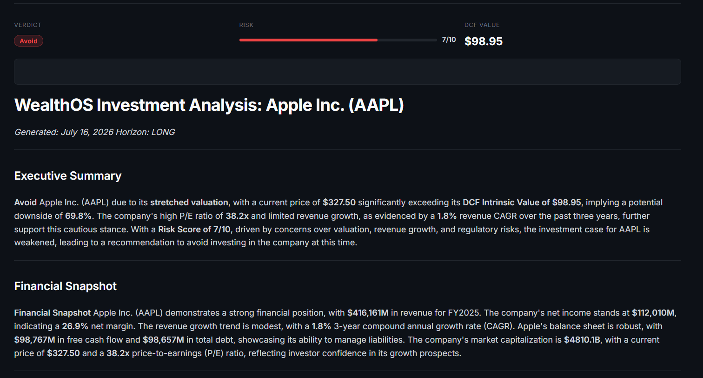

<div align="center">

# WealthOS

**Personal Financial Intelligence Platform**

[](https://python.org)
[](https://langchain.com)
[](https://fastapi.tiangolo.com)
[](https://postgresql.org)
[](https://redis.io)
[](https://streamlit.io)

*8 specialized agents × 7 MCP servers × 45 tools → one personalized investment memo in under 90 seconds.*

</div>

---

## What It Does

A user asks: **"Should I invest ₹20,000 in Reliance right now?"**

WealthOS knows their monthly surplus is ₹18,000, food spending spiked 35% last month, they have an outstanding home loan EMI, and their 80C deduction is unutilized. It remembers their last three analyses across sessions. The output is not generic advice — it is advice for **this person, at this moment in their financial life.**

---

## Architecture

```text
 User (Streamlit UI)
        │
        ▼
 FastAPI Backend
        │
        ▼
 LangGraph Orchestrator  (8 nodes, parallel where possible)
        │
        ├── Router        → picks horizon, company tier, fetch plan
        ├── Finance        ┐
        ├── Data           │  run in parallel
        ├── Research       │  (asyncio.gather)
        ├── Risk           │
        ├── Code           │
        ├── Rebalancing    ┘
        └── Writer        → compiles the final memo
        │
        ▼
 7 MCP Servers (45 tools)
   market · sec_edgar · news · finance · calculator · tax · portfolio
        │
        ▼
 Storage & Services
   Postgres (facts) · Redis (cache) · Qdrant (RAG + memory)
   E2B (DCF / Monte Carlo sandbox) · Temporal (morning cron)
        │
        ▼
 Investment Memo  (Buy / Hold / Avoid)
```

Each of the 8 orchestrator nodes is an agent that calls into the MCP servers for data, then the storage layer for context (past decisions, cached prices, indexed filings).

---

<div align="center">

## Agents

| Agent | Approach | Key Capability | Output |
|:---:|:---:|:---:|:---:|
| Router Agent | LLM classification + Qdrant count | Classifies horizon (short/mid/long), company tier; triggers on-demand SEC 10-K download + indexing as background task when tier is `not_indexed` | `investment_horizon`, `company_tier`, `fetch_plan` |
| Finance Agent | Pure Python + asyncpg | z-score anomaly detection (σ = 2.0), 5-dim health score | Health Score 0–100, surplus, risk capacity |
| Research Agent | asyncio + RAG | Qdrant hybrid search on SEC 10-K filings, news fetch | Qualitative context, sentiment |
| Data Agent | asyncpg + MCPClient | Schema-validated numbers, Redis 15-min TTL, MCP fallback | `FinancialSnapshot` with confidence flag |
| Risk Agent | LangGraph 3-node debate | `_get_macro_context()` fetches live VIX / 10Y yield / S&P 500 / Fed Funds Rate; Stock analyst runs in parallel; Scorer injects past decisions (Qdrant) + user risk profile (Postgres); MacroAnalyst cites actual live figures | Risk score 1–10 + Buy/Hold/Avoid |
| Code Agent | E2B sandbox | Real Python execution — DCF, Monte Carlo (1 000 paths), sensitivity table | Intrinsic value, upside probability |
| Rebalancing Agent | Pure Python | 5% drift threshold, sector concentration warning | Rebalance actions with urgency |
| Writer Agent | DSPy BootstrapFewShot | Compiled few-shot prompt (28 golden examples); source citation trust hierarchy; injects user risk profile (buy/hold/avoid history) into Personal Finance Fit section; Final Verdict indexed to Qdrant `user_analyses` after each run | 7-section investment memo |

</div>

---

<div align="center">

## MCP Servers

| Server | Tools | Data Source |
|:---:|:---:|:---:|
| `market_server` | 13 | yfinance — price, P/E, market cap, historical, sector, competitors, options, technicals; FRED — 10Y yield, VIX, fed funds rate |
| `sec_edgar_server` | 5 | SEC EDGAR — 10-K / 10-Q filing URLs + XBRL facts |
| `news_server` | 4 | NewsAPI + Firecrawl + newspaper3k — headlines, full article body, sentiment, Reddit |
| `finance_server` | 6 | PostgreSQL — transactions, anomalies, subscriptions, EMIs, goals |
| `calculator_server` | 7 | XIRR (scipy brentq), SIP, EMI, FIRE, compound interest, goal savings |
| `tax_server` | 4 | Old vs new regime, STCG/LTCG (Budget 2024 rates), advance tax, 80C suggestions |
| `portfolio_server` | 6 | PostgreSQL + yfinance — holdings, P&L, allocation, add/remove holding |

**45 tools · stdio transport via MCPClient subprocess**

</div>

---

<div align="center">

## Under the Hood

| Category | Implementation | Detail |
|:---:|:---:|:---|
| **Orchestration** | LangGraph 8-node state machine | `asyncio.gather` for parallel data+research and parallel risk+code — ~2× speedup |
| **Routing** | Router Agent (node 0) | LLM classifies investment horizon; Qdrant chunk-count sets company tier (`well_indexed` / `thin_indexed` / `not_indexed`); fires `_on_demand_index()` as background task for unknown tickers |
| **MCP Transport** | MCPClient stdio subprocess | Each agent spawns the MCP server as a subprocess; JSON-RPC over stdin/stdout; retry-on-crash |
| **LLM** | Groq `llama-3.3-70b-versatile` | Key rotation across up to 3 Groq keys to stay under 12k TPM free tier limit |
| **RAG** | Qdrant hybrid search + Cohere reranking | `all-MiniLM-L6-v2` 384-dim dense (local CPU, no API key) + BM25 sparse; RRF fusion; 725+ points indexed (AAPL/MSFT/NVDA/GOOGL/TSLA/AMZN 10-K) |
| **Embeddings** | sentence-transformers/all-MiniLM-L6-v2 | 384-dim, runs on CPU, no API key required |
| **Memory** | Three-layer | (1) Mem0 — 2-line cross-session signal injected at pipeline start; (2) Qdrant `user_analyses` — Final Verdict embedded and written after every run, semantic past-decision retrieval; (3) Postgres `user_risk_profiles` — buy/hold/avoid counts, avg risk score, preferred sectors, updated per run |
| **Macro Data** | FRED + yfinance fallback | `_get_macro_context()` returns 10Y treasury yield, VIX, S&P 500, fed funds rate, plus derived `vix_regime` and `rate_environment` labels; cached 1 hour |
| **Prompt Optimization** | DSPy BootstrapFewShot | 28 golden examples; compiled to `eval/compiled_writer.json`; structural quality metric (7 sections + verdict) |
| **Observability** | LangSmith + W&B Weave | `@trace_node` on all 8 nodes; `user_id` masked to first 8 chars in trace metadata (PII); custom evaluators in `langsmith_evaluators.py` (section completeness, verdict consistency, number grounding) |
| **Rate Limiting** | In-memory sliding window | 10 req/min per `user_id` on `/analyze`; configurable via `ANALYZE_RATE_LIMIT` env var; returns HTTP 429 |
| **Personal Docs** | Permanent storage | Uploaded PDFs saved to `data/personal_docs/{user_id}/{filename}`; re-indexed on re-upload without duplication (delete-before-upsert in Qdrant) |
| **Code Execution** | E2B cloud sandbox | Isolated Docker container per run; DCF, Monte Carlo (1 000 paths), sensitivity grid |
| **Validation** | Custom Pydantic v2 validators | `guardrails/validators.py` — risk score 1–10, verdict in {Buy, Hold, Avoid}, memo section presence |
| **Auth** | bcrypt 5.x direct + PostgreSQL `users` table | passlib removed (incompatible with bcrypt 5.x); 72-byte UTF-8 cap before hash and verify |
| **Session** | streamlit-cookies-controller | 30-day browser cookies; restored on every refresh; cleared on sign-out |
| **Notifications** | Composio | Gmail + WhatsApp delivery without OAuth boilerplate |
| **Durability** | Temporal | Morning briefing cron at 08:00; crash-safe with automatic retry |

</div>

---

<div align="center">

## Tech Stack

| Layer | Technologies |
|:---:|:---|
| **Orchestration** | LangGraph (8-node StateGraph) · Temporal (durable workflows) |
| **LLM** | Groq `llama-3.3-70b-versatile` with 3-key rotation |
| **Embeddings** | `sentence-transformers/all-MiniLM-L6-v2` (384-dim, local CPU) |
| **RAG** | Qdrant local (hybrid dense + BM25 sparse · RRF fusion) · Cohere reranking |
| **Memory** | Mem0 (signal) · Qdrant `user_analyses` (semantic past verdicts) · Postgres `user_risk_profiles` (quantitative profile) |
| **Prompt Optimization** | DSPy BootstrapFewShot (28 golden examples) |
| **Validation** | Custom Pydantic v2 validators |
| **Code Execution** | E2B Sandbox |
| **Database** | PostgreSQL 16 (11 tables: transactions, subscriptions, financial\_goals, emis, financial\_facts, portfolio\_holdings, tracked\_symbols, indexed\_tickers, user\_risk\_profiles, users, analysis\_history) |
| **Vector Store** | Qdrant (local, localhost:6333) — `wealthos_docs` + `user_analyses` collections |
| **Cache** | Redis (5-min market data TTL · 15-min snapshot TTL · 1-hour macro TTL) |
| **MCP Transport** | MCPClient stdio subprocess (services/mcp\_client.py) |
| **Macro Data** | FRED API (`fredapi`) · yfinance fallback (^TNX, ^VIX, ^GSPC) |
| **Notifications** | Composio (Gmail + WhatsApp) |
| **Observability** | LangSmith (pipeline traces · PII-masked user\_id) · W&B Weave (eval quality) |
| **Backend** | FastAPI (rate-limited · permanent doc storage) |
| **Frontend** | Streamlit (light theme · cookie sessions · session memory view) |

</div>

---

<div align="center">

## Roadmap

| Feature | Status |
|:---:|:---:|
| Multi-user auth — signup / login / bcrypt / cookie sessions | ✅ Done |
| Full 8-agent pipeline end-to-end | ✅ Done |
| MCP stdio transport via MCPClient | ✅ Done |
| LangSmith tracing on all 8 nodes | ✅ Done |
| RAG — 725+ Qdrant points (AAPL / MSFT / NVDA / GOOGL / TSLA / AMZN 10-K) | ✅ Done |
| DSPy BootstrapFewShot compiled writer (28 golden examples) | ✅ Done |
| W&B Weave LLM-as-judge eval (4-dimension scoring) | ✅ Done |
| Analysis history — full memo stored, Reports page | ✅ Done |
| Personal document RAG (salary slips, bank statements via OCR) | ✅ Done |
| A2A agent cards at `/agents` endpoint | ✅ Done |
| Dockerfiles (api / frontend / mcp) | ✅ Done |
| Investment horizon routing (short / mid / long-term) | ✅ Done |
| API key auth + rate limiting on `/analyze` (10 req/min) | ✅ Done |
| DeepEval CI gate (Gemini judge, GitHub Actions) | ✅ Done |
| Full news article body fetch (newspaper3k) | ✅ Done |
| `user_analyses` Qdrant collection — per-user verdict vectors (read + write) | ✅ Done |
| Three-layer memory (Mem0 signal + Qdrant semantic + Postgres quantitative) | ✅ Done |
| On-demand SEC EDGAR indexing for unknown tickers | ✅ Done |
| FRED macro data (10Y yield, VIX, fed funds rate) | ✅ Done |
| Permanent personal doc storage | ✅ Done |
| LangSmith custom evaluators (section completeness, verdict consistency, number grounding) | ✅ Done |
| E2E test suite (pytest · 7 assertions · AAPL full pipeline) | ✅ Done |
| PII masking in LangSmith traces | ✅ Done |
| Chunk staleness tracking (info\_type + half\_life\_days + confidence degradation at retrieval) | ✅ Done |
| Input sanitization + prompt injection guard on `/analyze` | ✅ Done |
| User risk profile injected into Writer Agent (Personal Finance Fit section) | ✅ Done |
| Indian stock BSE PDF indexer (30 companies) | 🔄 Planned |
| Earnings call transcript indexing | 🔄 Planned |

</div>

---

<div align="center">

## Quick Start

```bash
git clone https://github.com/AmanDataGuy/WealthOS
cd WealthOS
python -m venv venv && venv\Scripts\activate   # Windows
pip install -r requirements.txt
cp .env.example .env                           # fill in GROQ_API_KEY, WEALTHOS_DB_URL, etc.
```

**Start infrastructure (Docker Desktop must be running):**
```bash
docker start wealthos-postgres wealthos-redis wealthos-qdrant
```

**Initialise the database:**
```bash
psql -h localhost -U wealthos -d wealthos -f scripts/init_db.sql
```

**Start API and UI (Windows — sets UTF-8 encoding required for emoji prints):**
```powershell
$env:PYTHONIOENCODING='utf-8'
python -m uvicorn api.main:app --host 0.0.0.0 --port 8000
# in a second terminal:
streamlit run wealthos_app.py --server.port 8501
```

Open **http://localhost:8501** — sign up, or use demo accounts: `admin / wealthos123` · `demo / demo123`.

**Index SEC filings for RAG (first time only):**
```bash
python -m rag.indexer batch AAPL MSFT NVDA GOOGL TSLA AMZN
```

**Required environment variables:**

| Variable | Purpose |
|---|---|
| `GROQ_API_KEY` | Primary LLM (required) |
| `WEALTHOS_DB_URL` | PostgreSQL connection string (required) |
| `REDIS_URL` | Redis (default: `redis://localhost:6379`) |
| `QDRANT_URL` | Qdrant (default: `http://localhost:6333`) |
| `E2B_API_KEY` | Code sandbox — DCF / Monte Carlo |
| `MEM0_API_KEY` | Cross-session memory |
| `LANGCHAIN_API_KEY` | LangSmith pipeline tracing |
| `WANDB_API_KEY` | W&B Weave eval tracking |
| `COHERE_API_KEY` | RAG reranking |
| `FRED_API_KEY` | Macro data — 10Y yield, fed funds rate (optional; yfinance fallback) |
| `GEMINI_API_KEY` | DeepEval CI judge |

See `.env.example` for the full list.

---

## Demo


*The Analyze page — set a ticker, investment amount, horizon, and optionally attach loan/EMI documents for personalised context.*


*A completed memo — verdict, risk score, and DCF intrinsic value up top, followed by the full 7-section analysis.*

**Suggested tickers for a live walkthrough:**

| Market | Tickers | RAG Coverage |
|--------|---------|----------|
| US | `NVDA` `MSFT` `AAPL` `AMZN` `GOOGL` `TSLA` | Full SEC 10-K indexed in Qdrant |
| India | `SBIN` `RELIANCE` `TCS` `INFY` `WIPRO` `HCLTECH` `ICICIBANK` `HDFCBANK` | Live via yfinance (no pre-indexed filing) |

**3-minute script:**

1. **Analyze page** — In the query box write e.g. *"I have ₹30k–50k to invest and I'm fairly conservative. Should I add NVDA to my portfolio right now?"* · set Ticker to `NVDA` · pick **Long-term** horizon · hit **Run analysis** (~60 s) → results show Verdict pill, Risk score bar, DCF intrinsic value, and the full 7-section memo with a Download button
2. Expand **Agent log** at the bottom → walk through each node: Router → Finance → Data → Research → Risk → Code → Rebalancing → Writer
3. Switch to **History** page → open the **Memory** sub-tab → show the investor profile (total analyses, Buy/Hold/Avoid counts, avg risk score, tracked sectors) and the past-decisions table that feeds every new risk analysis
4. Open **`http://<host>:8000/docs`** → show the rate-limited `/analyze` endpoint (10 req/min per user), `/upload-personal-doc`, and A2A agent cards at `/agents`

Any ticker works — live data via yfinance even without a pre-indexed filing; unknown tickers trigger on-demand 10-K download and Qdrant indexing in the background.

</div>
