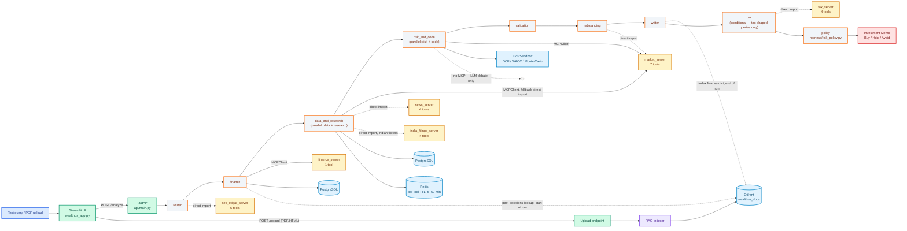
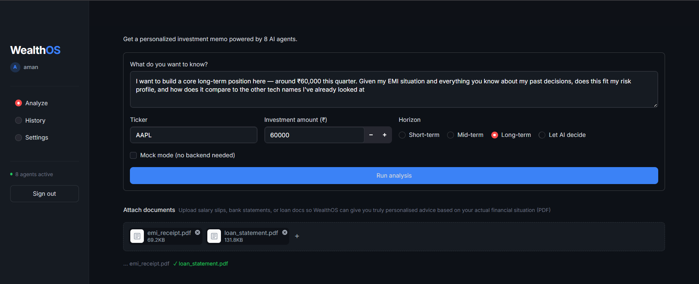
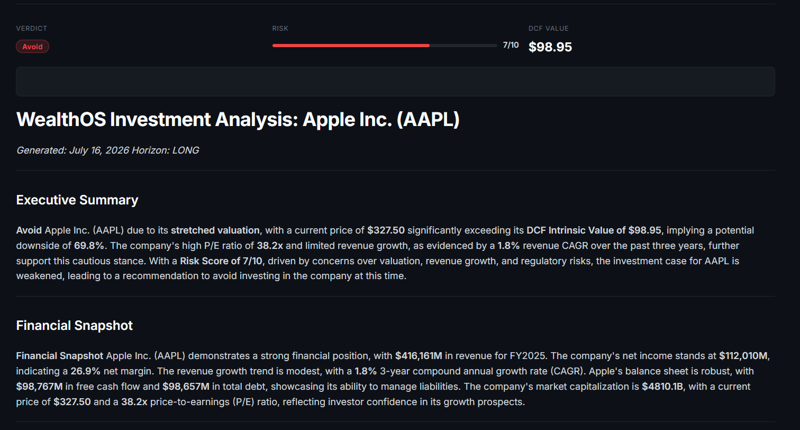

<div align="center">

# WealthOS

**Personal Financial Intelligence Platform**

[](https://python.org)
[](https://langchain.com)
[](https://fastapi.tiangolo.com)
[](https://postgresql.org)
[](https://redis.io)
[](https://streamlit.io)

*9 specialized agents × 6 MCP servers × 25 tools → one personalized investment memo, grounded in real filings and computed math.*

</div>

---

## What It Does

A user asks: **"Should I invest ₹20,000 in Reliance right now?"**

WealthOS knows their monthly surplus is ₹18,000, food spending spiked 35% last month, they have an outstanding home loan EMI, and their 80C deduction is unutilized. It remembers their last three analyses across sessions. The output is not generic advice — it is advice for **this person, at this moment in their financial life.**

---

## Architecture


```mermaid
flowchart LR
    classDef input fill:#dbeafe,stroke:#2563eb,stroke-width:2px,color:#1e3a8a
    classDef interface fill:#d1fae5,stroke:#059669,stroke-width:2px,color:#064e3b
    classDef mcp fill:#fef3c7,stroke:#d97706,stroke-width:2px,color:#78350f
    classDef mcpdead fill:#f5f5f4,stroke:#a8a29e,stroke-width:1px,color:#78716c,stroke-dasharray: 4 3
    classDef graphnode fill:#f1f5f9,stroke:#f97316,stroke-width:2px,color:#7c2d12
    classDef intel fill:#ede9fe,stroke:#7c3aed,stroke-width:2px,color:#4c1d95
    classDef data fill:#e0f2fe,stroke:#0284c7,stroke-width:2px,color:#0c4a6e
    classDef output fill:#fee2e2,stroke:#dc2626,stroke-width:2px,color:#7f1d1d
    classDef separate fill:#f5f5f4,stroke:#78716c,stroke-width:2px,color:#44403c

    Input[Text query / PDF upload]:::input --> UI[Streamlit UI<br>wealthos_app.py]:::interface
    UI -- "POST /analyze" --> API[FastAPI<br>api/main.py]:::interface
    UI -- "POST /upload (PDF/HTML)" --> Upload[Upload endpoint]:::interface
    Upload --> Indexer[RAG Indexer]:::intel --> Qdrant[(Qdrant<br>wealthos_docs)]:::data

    API --> N0[router]:::graphnode
    N0 --> N1[finance]:::graphnode
    N1 --> N2["data_and_research<br>(parallel: data + research)"]:::graphnode
    N2 --> N3["risk_and_code<br>(parallel: risk + code)"]:::graphnode
    N3 --> N4[validation]:::graphnode
    N4 --> N5[rebalancing]:::graphnode
    N5 --> N6[writer]:::graphnode
    Output[Investment Memo<br>Buy / Hold / Avoid]:::output

    N0 -. "direct import" .-> SEC[sec_edgar_server<br>5 tools]:::mcp

    N1 -- MCPClient --> FIN[finance_server<br>1 tool]:::mcp
    N1 --> PG1[(PostgreSQL)]:::data
    N1 -. "past-decisions lookup, start of run" .-> Qdrant

    N2 -- "MCPClient, fallback direct import" --> MKT[market_server<br>7 tools]:::mcp
    N2 -. "direct import" .-> NEWS[news_server<br>4 tools]:::mcp
    N2 -. "direct import, Indian tickers" .-> INDIA[india_filings_server<br>4 tools]:::mcp
    N2 --> PG2[(PostgreSQL)]:::data
    N2 --> Redis[(Redis<br>per-tool TTL, 5–60 min)]:::data

    N3 -- MCPClient --> MKT
    N3 --> Sandbox[E2B Sandbox<br>DCF / WACC / Monte Carlo]:::data
    N3 -. "no MCP — LLM debate only" .-> RiskNote(( )):::mcpdead

    N5 -. "direct import" .-> MKT

    N6 -. "index final verdict, end of run" .-> Qdrant
    N6 --> N6b["tax<br>(conditional — tax-shaped queries only)"]:::graphnode
    N6b -. "direct import" .-> TAX[tax_server<br>4 tools]:::mcp
    N6b --> N7[policy<br>harness/risk_policy.py]:::graphnode
    N7 --> Output
```

> Most MCP servers are called via **direct Python import**, not the MCP protocol — only `finance`, `data_and_research` (market fetch), and `risk_and_code` (E2B fetch) go through `MCPClient`. Full rationale in [`docs/adr/001-mcp-transport-boundary.md`](docs/adr/001-mcp-transport-boundary.md).

---

<div align="center">

## Agents

| Agent | Approach | Key Capability | Output |
|:---:|:---:|:---:|:---:|
| Router Agent | LLM classification + Qdrant count | Classifies investment horizon and company indexing tier; triggers background filing indexing for unknown tickers | `investment_horizon`, `company_tier` |
| Finance Agent | Pure Python + asyncpg | Z-score spending anomaly detection, 5-dim health score; Tesseract-first OCR for receipts/statements; EMI transactions classified by loan type | Health Score 0–100, `emi_by_type` |
| Research Agent | asyncio + RAG | Hybrid search on SEC 10-K filings, news (NewsAPI + Google News RSS fallback), SEC Form 4 insider trades, India NSE results | Qualitative context, sentiment |
| Data Agent | asyncpg + MCPClient | Schema-validated financial numbers with staleness-aware confidence scoring | `FinancialSnapshot` + confidence flag |
| Risk Agent | LangGraph 3-node debate | Live macro context (VIX, 10Y yield, S&P 500, Fed Funds) plus past-decision history inform the call | Risk score 1–10 + Buy/Hold/Avoid |
| Code Agent | E2B sandbox | Real DCF, Monte Carlo (1,000 paths), sensitivity analysis | Intrinsic value, upside probability |
| Rebalancing Agent | Pure Python | Flags any sector drifting >5 percentage points from target allocation | Rebalance actions with urgency |
| Writer Agent | DSPy BootstrapFewShot | Compiled few-shot prompt (28 golden examples) writes the memo, citing sources and past decisions | 7-section investment memo |
| Tax Agent | Pure Python (`tax_server`) | Gated to tax-shaped queries; old vs. new regime comparison plus loan-type deductions (§24(b) home loan, §80E education loan) | Appended "Tax Impact" section |

</div>

---

<div align="center">

## MCP Servers

| Server | Tools | Data Source |
|:---:|:---:|:---:|
| `market_server` | 7 | yfinance — price, financials, history, technicals, options |
| `sec_edgar_server` | 5 | SEC EDGAR filings, XBRL facts, Form 4 insider trades |
| `news_server` | 4 | NewsAPI (free Google News RSS fallback) + Firecrawl Reddit sentiment |
| `finance_server` | 1 | PostgreSQL transaction history |
| `tax_server` | 4 | Old vs. new regime comparison, capital gains tax, loan-type deductions, advance tax schedule |
| `india_filings_server` | 4 | NSE (`nsepython`) — quotes, financial results, corporate events |

**25 tools across 6 servers.** Most go through MCPClient stdio; `sec_edgar_server`, `news_server`, `india_filings_server`, `tax_server`, and `rebalancing`'s market calls bypass MCP via direct Python import — see [ADR 001](docs/adr/001-mcp-transport-boundary.md).

</div>

---

<div align="center">

## Under the Hood

| Category | Stack | Detail |
|:---:|:---|:---|
| **Orchestration** | LangGraph, 10-node StateGraph | `asyncio.gather` parallelizes data+research and risk+code (~2× speedup) |
| **LLM** | Groq `openai/gpt-oss-120b` + OpenRouter fallback | Key rotation across up to 20 Groq keys (5 configured); `reasoning_effort: "low"` on every call to avoid reasoning-token starvation |
| **RAG** | Qdrant hybrid search + Cohere rerank | Dense (`all-MiniLM-L6-v2`, local CPU) + BM25 sparse, RRF fusion |
| **Memory** | Qdrant `user_analyses` + Postgres `user_risk_profiles` | Semantic/exact-ticker recall plus aggregate buy/hold/avoid stats — two layers by design |
| **Prompt Optimization** | DSPy BootstrapFewShot | 28 golden examples, compiled prompt is the primary memo-writing path |
| **Code Execution** | E2B cloud sandbox | Real DCF, Monte Carlo, sensitivity grid, isolated per run |
| **Policy Gate** | `harness/risk_policy.py`, no LLM | Deterministic allow/deny/escalate on every Buy — oversized positions denied, low-confidence or track-record-contradicting calls escalated |
| **Live Progress** | SSE (`POST /analyze/stream`) | Real per-node events as each of the 10 nodes finishes, not a fake word-chop |
| **A2A** | `POST /agents/risk_agent/invoke` | One agent independently callable outside the full pipeline |
| **Verdict Backtesting** | `GET /history?backtest=true` | Lazy yfinance return-since-verdict per past analysis, capped at 15 rows |
| **Data Trust** | Per-field `updated_at` + staleness decay | Confidence capped when source data is stale; RAG chunks flagged past 180 days |
| **Macro Data** | FRED + yfinance fallback | 10Y yield, VIX, S&P 500, Fed Funds Rate, 15-min cache |
| **Database** | PostgreSQL 16, 12 tables | `transactions`, `emis`, `financial_facts`, `user_risk_profiles`, `analysis_history`, etc. |
| **Vector Store** | Qdrant | `wealthos_docs` + `user_analyses` collections |
| **Cache** | Redis | Per-tool TTLs, 5 min–24 hr depending on data volatility |
| **Observability** | LangSmith + W&B Weave | PII-masked `user_id` in traces; 4-dim LLM-as-judge eval scoring |
| **Validation** | Pydantic v2 | Risk score range, verdict enum, memo section presence |
| **Auth** | bcrypt + JWT | 30-day sessions; fail-open locally, fail-closed when `WEALTHOS_ENV=production` |
| **Rate Limiting** | Redis sliding-window log | 10 req/min per user, configurable, fails closed in production |
| **Backend / Frontend** | FastAPI / Streamlit | Rate-limited API; cookie-session UI with permanent personal-doc storage |

</div>

---

<div align="center">

## Eval Results

**26/28 (93%)** passed the DeepEval quality gate against the full golden dataset, judged by `gemini-2.5-flash-lite`. Faithfulness and Hallucination both at 100% across all 28 examples (US/Indian equities, ETFs, crypto, debt payoff, tax planning). See [`eval_report.md`](eval_report.md) for the full breakdown and known issues.

</div>

---

<div align="center">

## Quick Start

```bash
git clone https://github.com/AmanDataGuy/WealthOS
cd WealthOS
python -m venv venv && venv\Scripts\activate   # Windows
pip install -r requirements.txt
cp .env.example .env                           # fill in GROQ_API_KEY, WEALTHOS_DB_URL, etc.
```

**Start infrastructure (Docker Desktop must be running):**
```bash
docker start wealthos-postgres wealthos-redis wealthos-qdrant
```

**Initialise the database:**
```bash
psql -h localhost -U wealthos -d wealthos -f scripts/init_db.sql
```

**Start API and UI (Windows — sets UTF-8 encoding required for emoji prints):**
```powershell
$env:PYTHONIOENCODING='utf-8'
python -m uvicorn api.main:app --host 0.0.0.0 --port 8000
# in a second terminal:
streamlit run wealthos_app.py --server.port 8501
```

Open **http://localhost:8501** — sign up, or use demo accounts: `admin / wealthos123` · `demo / demo123`.

**Index SEC filings and populate financial facts (first time only):**
```bash
python -m rag.indexer batch AAPL MSFT NVDA GOOGL TSLA AMZN
python -m rag.populate_facts AAPL MSFT NVDA GOOGL TSLA AMZN
```
Skipping the second command leaves `financial_facts` empty — the Data Agent falls back to live-price-only data and every analysis reports `confidence: low`.

**Required environment variables:**

| Variable | Purpose |
|---|---|
| `GROQ_API_KEY` | Primary LLM (required) |
| `OPENROUTER_API_KEY` | Fallback LLM provider if every Groq key fails — recommended |
| `WEALTHOS_DB_URL` | PostgreSQL connection string (required) |
| `REDIS_URL` | Redis (default: `redis://localhost:6379`) |
| `QDRANT_URL` | Qdrant (default: `http://localhost:6333`) |
| `E2B_API_KEY` | Code sandbox — DCF / Monte Carlo |
| `LANGCHAIN_API_KEY` | LangSmith pipeline tracing |
| `WANDB_API_KEY` | W&B Weave eval tracking |
| `COHERE_API_KEY` | RAG reranking |
| `FRED_API_KEY` | Macro data — 10Y yield, fed funds rate (optional; yfinance fallback) |
| `FIRECRAWL_API_KEY` | News/Reddit full-article scraping; earnings call transcript indexing |
| `WEALTHOS_JWT_SECRET` | Signs JWTs protecting every `{user_id}`-scoped endpoint — recommended |

See `.env.example` for the full list.

---

## Demo

**[Watch the full walkthrough on YouTube](https://youtu.be/6H6aCxz2w0U)** — the pipeline explained, then a live run of a real multi-part investment question end to end.


*The Analyze page — set a ticker, investment amount, horizon, and optionally attach loan/EMI documents for personalised context.*


*A completed memo — verdict, risk score, and DCF intrinsic value up top, followed by the full 7-section analysis.*

**Suggested tickers for a live walkthrough:**

| Market | Tickers | RAG Coverage |
|--------|---------|----------|
| US | `NVDA` `MSFT` `AAPL` `AMZN` `GOOGL` `TSLA` | Full SEC 10-K indexed in Qdrant |
| India | `SBIN` `RELIANCE` `TCS` `INFY` `WIPRO` `HCLTECH` `ICICIBANK` `HDFCBANK` | Live via yfinance + NSE; annual report auto-indexed on first query |

**3-minute script:**

1. **Analyze page** — query e.g. *"I have ₹30k–50k to invest and I'm fairly conservative. Should I add NVDA to my portfolio right now?"* · ticker `NVDA` · **Long-term** horizon · **Run analysis** → Verdict pill, Risk score bar, DCF intrinsic value, full 7-section memo
2. Expand **Agent log** → walk through each node: Router → Finance → Data → Research → Risk → Code → Rebalancing → Writer → Tax (conditional) → Policy
3. **History** page → **Memory** sub-tab → investor profile and past-decisions table that feeds every new risk analysis
4. **`http://<host>:8000/docs`** → the rate-limited `/analyze` endpoint, `/upload-personal-doc`, the 9 agent metadata cards at `/agents`, and `POST /agents/risk_agent/invoke` (try `{"ticker": "NVDA"}`)

Any ticker works — live data via yfinance even without a pre-indexed filing; unknown tickers trigger on-demand indexing in the background.

</div>
